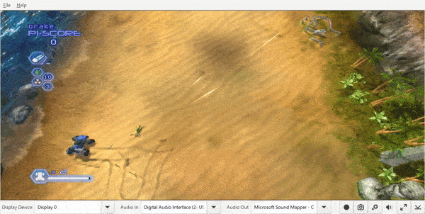
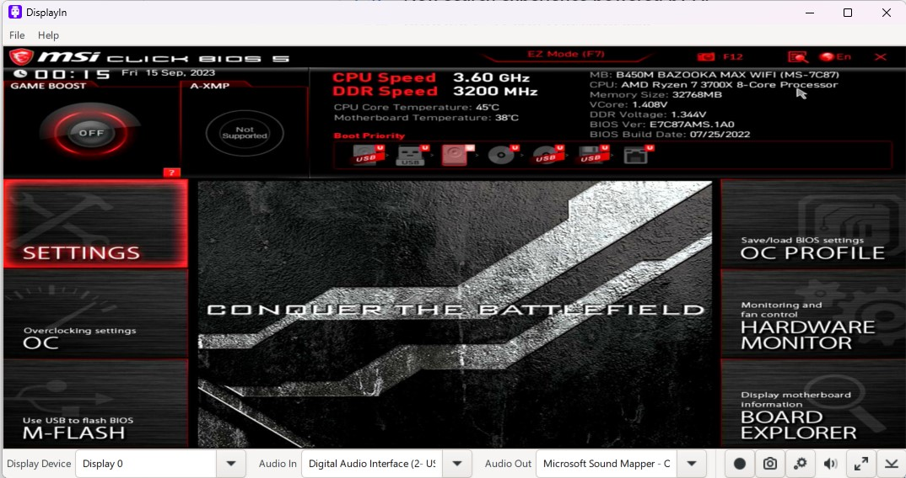

<!--
Copyright (c) 2023 Tekst LLC.

This file is part of DisplayIn 
(see https://github.com/displayin).

This program is free software: you can redistribute it and/or modify
it under the terms of the GNU General Public License as published by
the Free Software Foundation, either version 3 of the License, or
(at your option) any later version.

This program is distributed in the hope that it will be useful,
but WITHOUT ANY WARRANTY; without even the implied warranty of
MERCHANTABILITY or FITNESS FOR A PARTICULAR PURPOSE.  See the
GNU General Public License for more details.

You should have received a copy of the GNU General Public License
along with this program. If not, see <http://www.gnu.org/licenses/>.-->
# DisplayIn
DisplayIn is a powerful tool that allows you to stream any device to your PC using a capture device.
It's simple and easy to use. You can turn any laptop into an extra monitor, record and capture screenshots
from your favorite console, or even view your PC's BIOS screen.
 

## Features
- Fullscreen streaming up to 4K @ 60fps
- MP4 video screen recording
- Screenshot capture
- Ability to turn laptops into an extra monitor

## Usage
Before launching DisplayIn, you must ensure that your capture device is plugged into your PC. When launching DisplayIn you will be greeted with this user interface. To ensure it is working properly, you should configure the following settings:
