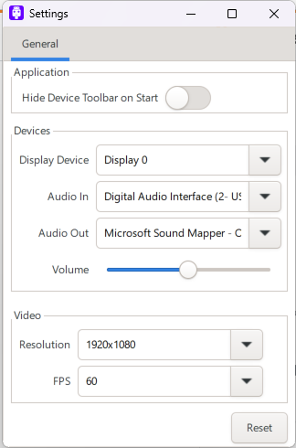

<!--
Copyright (c) 2023 Tekst LLC.

This file is part of DisplayIn 
(see https://github.com/displayin).

This program is free software: you can redistribute it and/or modify
it under the terms of the GNU General Public License as published by
the Free Software Foundation, either version 3 of the License, or
(at your option) any later version.

This program is distributed in the hope that it will be useful,
but WITHOUT ANY WARRANTY; without even the implied warranty of
MERCHANTABILITY or FITNESS FOR A PARTICULAR PURPOSE.  See the
GNU General Public License for more details.

You should have received a copy of the GNU General Public License
along with this program. If not, see <http://www.gnu.org/licenses/>.-->

 
 

# DisplayIn
DisplayIn is a powerful tool that allows you to stream any device to your PC using a capture device.
It's simple and easy to use. You can turn any laptop into an extra monitor, record and capture screenshots
from your favorite console, or even view your PC's BIOS screen.

***Beta version notice*** - This application is currently in beta testing. Please report any bugs you encounter.

## Features
- Fullscreen streaming up to 4K @ 60fps
- MP4 video screen recording
- Screenshot capture
- Ability to turn laptops into an extra monitor

## Requirements
- A compatible screen capture device (eg. [Guermok Capture Card](https://www.amazon.com/gp/product/B08Z3XDYQ7/ref=ppx_yo_dt_b_search_asin_title?ie=UTF8&th=1))
- Windows or Linux operating system
- 4GB of RAM (8GB is recommended for smooth recording)
- Dual-core processor either Intel or AMD

# Usage
Before launching DisplayIn, you must ensure that your capture device is plugged into your PC. When launching DisplayIn you will be greeted with this user interface. To ensure it is working properly, you should configure the following settings from the bottom taskbar:
- ***Display Device*** - Select your capture device from this drop-down, note this list will also include any connected webcams.
- ***Audio In*** - Select your capture device's audio input from this drop-down, note this will also include any connected microphones.
- ***Audio Out*** - Select your audio output device hfrom this drop-down.

Your settings will automatically be saved.

## Controls
On the botton taskbar, to the right of the device selection drop-downs, there are the following buttons from left to right.
- ***Record Video*** - Starts recording video, note you must have sufficient space on your drive for longer video recordings. When recording, all settings will be locked and cannot be changed until the recording has stopped. By default, recordings will be saved to `$DISPLAYIN_ROOT/recordings` unless you choose a different save location when prompted.
- ***Screenshot*** - Takes a screenshot and saves them to `$DISPLAYIN_ROOT/screenshots`.
- ***Settings*** - Opens an additional Settings window.
- ***Volume*** - Controls output volume of the stream, note that this does not affect the recording volume.
- ***Fullscreen*** - Toggles fullscreen, you can also press ctrl + f.
- ***Hide Taskbar*** - Hides the taskbar, you can also press ctrl + h. To make the taskbar re-appear simply move your cursor to the bottom of the window.

## Settings window
To open the additional settings click the ***Settings* button on the taskbar or select File > Preferences.

### Application
- ***Hide Device Toolbar on Start*** - When enabled the bottom toolbar will be hidden when DisplayIn starts

### Video
- ***Resolution*** - Select the resolution of the stream.
- ***FPS*** - Select the desired frames-per-second of the stream

## Troubleshooting
Please report any errors by filing an issue. Please first check whether an existing issue has been filed for the bug you encountered. Please zip and attach logs found in the `$DISPLAYIN_ROOT/logs` folder so that we can better assist in troubleshooting the matter.

# Additional Links
 - [Developer Manual](src/displayin/doc/dev/DEV_SETUP.md)

